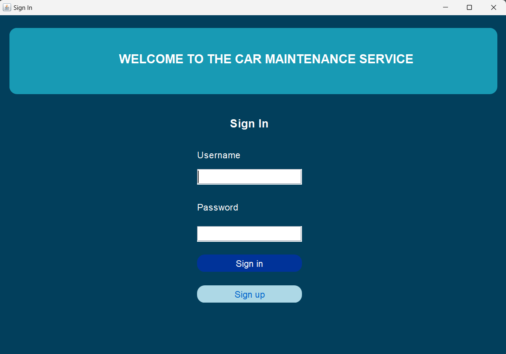
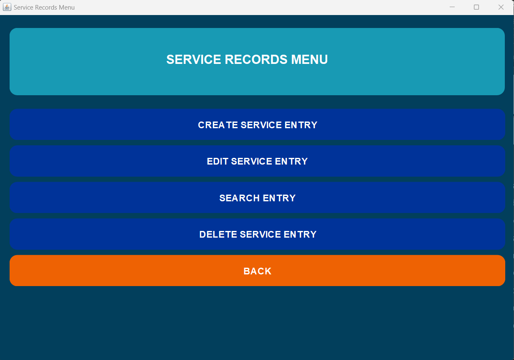
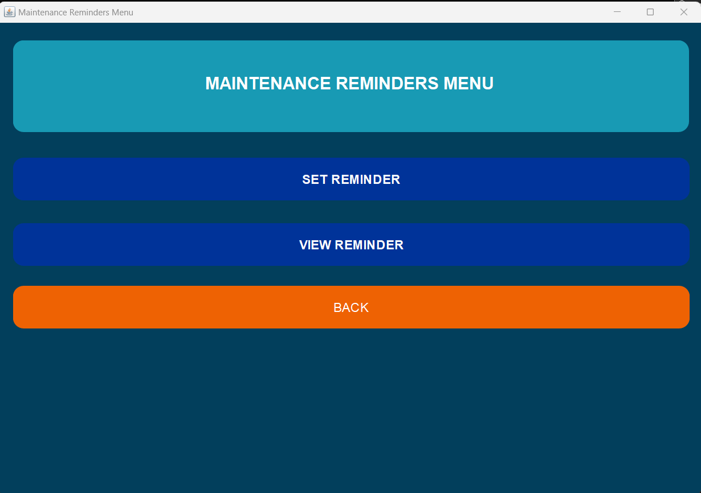
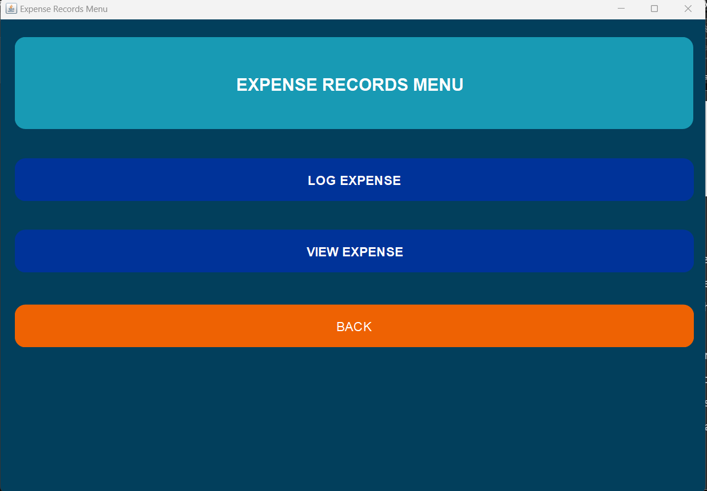
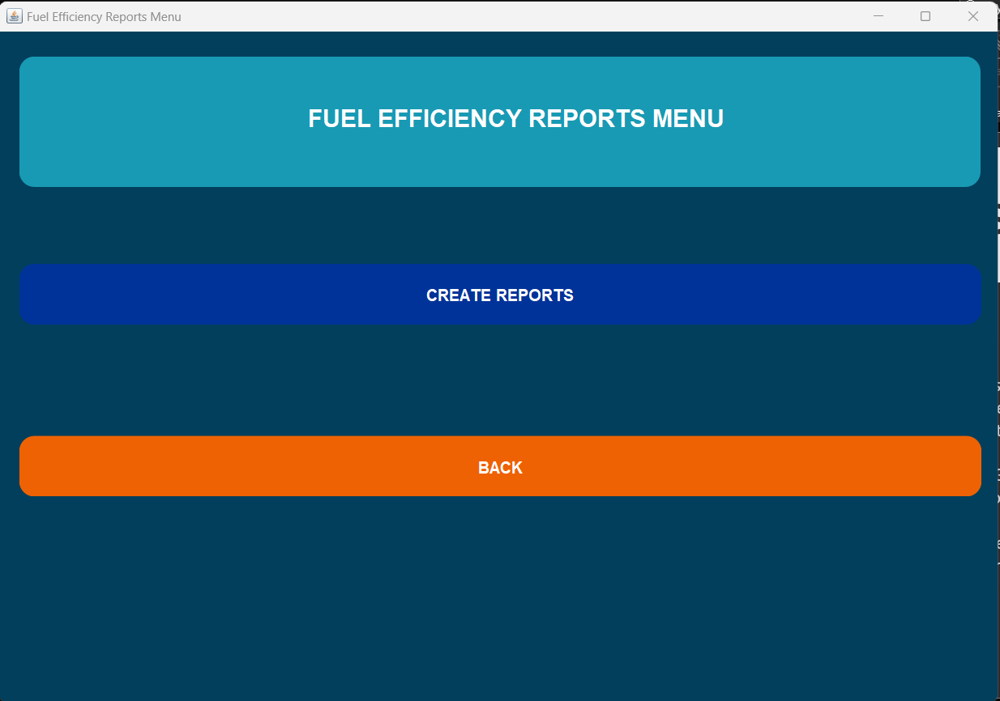
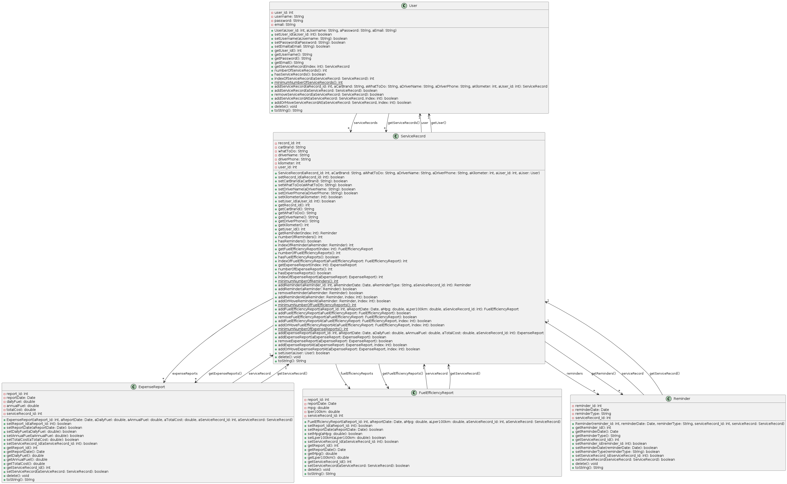
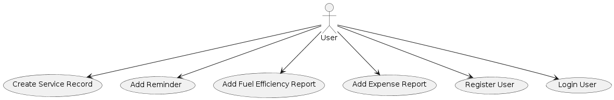
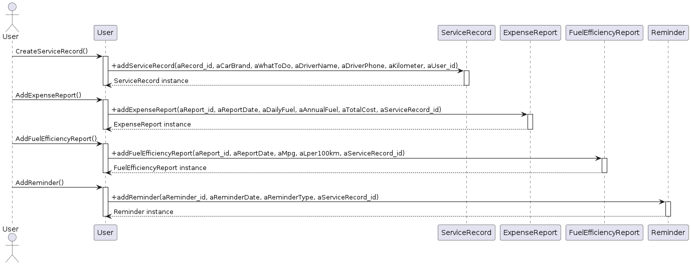

# Car Maintenance System Application

# Overview

The Car Maintenance System Application is a software tool designed to assist users in managing their car's maintenance. This application allows users to create their service history easily, set reminders for the next annual maintenance, manage their expenses, and create their fuel efficiency reports.

## Releases

- 

## Platforms

- 

- 

- 

## Test Coverage

**Coverage**

- 

**Branch Coverage**

- 

**Line Coverage**

- 

**Method Coverage**

- 

### Installation

git@github.com:cakirerayburak/ce204-final-project-eray-burak-cakir-java.git

### Contributors

Samet Karas

Eray Burak Cakir

Suleyman Mert Almali

## About Project

#### User Authentication

It allows users to create accounts for personalized car maintenance tracking and record-keeping.

#### Service History Tracking

It provides a way for users to log and track the service history of their vehicles. Users can record details such as service date, type of service (e.g., oil change, tire rotation), service provider, and cost.

#### Maintenance Reminders

It is a reminder system that notifies users when it's time for scheduled maintenance tasks (e.g., oil change, brake inspection) based on mileage or time intervals.

#### Expense Logging

It allows users to log and categorize expenses related to their vehicles, including fuel costs, repairs, and maintenance. Users can track expenses over time and generate reports.

#### Fuel Efficiency Reports

It calculates and provides fuel efficiency reports that show metrics like miles per gallon (MPG) or liters per 100 kilometers (L/100km). Users can see their vehicle's fuel efficiency trends.

### Contact

[Samet Karas](mailto:samet_karas21@erdogan.edu.tr)

[Eray Burak Cakir](mailto:erayburak_cakir21@erdogan.edu.tr)

[Suleyman Mert Almali](mailto:suleymanmert_almali@erdogan.edu.tr)

## Plantuml Diagram

[Plantuml Link](http://www.plantuml.com/plantuml/png/pLXDKzn643t7lsBAfzbWAFkgGyeRGow9Fyf0vU1ofGPfM1JqiJKQhKrH_kyPYPtUdgVnIWYAS07qfgVxTQkxwTRRnYfZsx9uaHQgQSHveutuykLVjL59MfT7-Y9LrqUfCgNAAwihLQMwBTU5FkealtuLjoz-EMpTd__aMIASoFQnKgLEnAarURLoqDhf_bQRZ47QQInspmUTFgdEcQfNGfs3AWTz8bK4dN1L2wUhqNQhADIuICH5NHTQLIJKgvS3GoZfhKgmFvJioKZE2MHMEtABdbM7CIuB5fGLimnuRm31KsqsUQe_wxIxaLUP_kuT3uwSTDMM5zfyl0pmPaVfIZLunBteTSDjgO97i4cQRnkhR9x-46LUvMLRVXXXeh8CpDpzPddoJfdVZQfuKlnzfUnPVLmpwDZa6sq-g58Fm4zNTSNHF_EYBhNLnbk0D89e0iVHKF186btM6pttDXfUslsNNmcM5Q3eetaFJEQhotIXRP_Ccphl8cJhk-2obFsnRJg1Hd7hyBuD7Hx-9bx--XAE4z7mvsQUZfMsc6vRHIVVrxfg7BokZPtM2eChsvve-WUVCGGSAwiJqVrqKARoukQFLXU9oEhsekWmLLMjAW2qjLN5kxgn30kYiBDp492HwkutAvNFmACh0UJXi2NnOE0Pyd3OQOm7u9WrsnvDt90czjGTPpdWZxBaZ1pwXR8x9sN4OPGcx-Km42WBKS6AZZgwyexYlmRc_i8dZyEPgmlFeplWVk494SS3f4S4q9kHvlI8JI2inBwItunqWmVgmZXGK-X2UN9vcQUvhjAR-_G6k7dV5b6kLwpcYxKsRrw_lYudz04qFBqTl2URtTDVQFCPrhnZB3bjF2SV9BZpVrMkume5o3W-_yh4t7fuWOBAcNKAWfCADBZYAnEAwJ25-T91tsY-92YZ-H90cYy9lGxcoy4ETV2S1bvwJ4JtqnUofuJiiA0yLJaWZPBU0mc-32LtZabmCYvD7ajmFofFiP0G5XGSNp9N52Ze31GLsE2yvuWpZ_647C8ZvWXkciD6LNQ3l0btHe-oTT53uQP8Q7H99ENA_xLJpKd4Ua18A2R1oCMEGw9nYHZfA1aLG-Eqk6Di-a2Fw0XSOJZwW4SHyh0418zWSsGjXpTE6pc-Kzui2E9Z1O5dDskglFWiWRc7veOfXDlqP76cUcbZqkFxyhpxyN2Fvx0p--IJNRpmaCtyEi6tzwWgVq9nUI-Durdmk3R6CmLQ1AJ8i_W8WDqDgKrfJPWQSs-ZuUN8vV4N_Y1rE4H8Fb_DdDEfvVJpTF16w3COYIJ2-BQ-PyNTeoagdeZB2Dp0bxKHrI2N2CsUITbv4tEKDeR-E17TL3qhEcmaSfNrg262GOVr-Dbn8iNO4kuLhDKs5nSGiMbxb9VsAnHC1GJngS23C1Ni-QhXhKWpc3g6wWc3cIEg761SdlcO_FFnURZfywc7rUpuPizDWRFGGi3yC0ue7d2AXMZqcqWqWdjloUPfFarut-P_Za0rapz1lDLLrfR5Vm00)

## Use-Case Diagram

[Use-Case Link](https://www.plantuml.com/plantuml/png/LP2_oeCm74NtFCKFTuVFFuuV5h5J9uiF49Ah13IHNs9ftxvA1UDuE6UutDe7oM6T9o5LS4oz1mknUYZfGKd3a07q1B-C0dLGZdL2qbFV_9tPJUlDpSPgy66pgxslcAWT1gCChFfizU8u76r-RTlt0kjnROgpwJ0Q7_0RU-Zor0yt6XkxIeYTA4t_zzanP37aCHGnb35KeeRLssLV)

## Sequence Diagram

[Sequence Diagram Link](https://www.plantuml.com/plantuml/png/XP8_Ry8m4CNtV0gBgLMBHDSE5HIIfNzK1QAErIa-YbN7jXm7bM_VCo75ZYnOudkdvzpxsPwt3gph6fb1xRHbLOisomprH2qCACSclZLXqB8gxg_HxaMD9TRQygDXNSQE_DUWQibXj7L7Hpvo51tAVBibZQe-1CPYx2on4OgVafHPvbEnwHEhs2DRMWI7KPwRMmyazjIdt1KvAHrPxu3ps0Zz-YNuFOCbs6SBofUVEt0RlT9KhgpOets71l_5nquhhrw4r0qwj5JxIFIRO38T24sTdc96SvbGhGDLOyOnz0UgYYaNd4S7ca3C1yJO2FtQ8_Rr2jmH1eGy-4kWUg5K1_8aDjg1NEhMKHtbZW7fbl8pO3Gr2PXV0KozXmHdCO2EDbpbVJFVz7qrQ1zciv_cCfn_WqM0bvgLf2okOGwFEO7MWmKM6AeUPr0UA92RWy7BD6Ls9Xbs9TEFiizHyQwHVm00)

### Instructor

Dr.Öğr.Uyesi Ugur CORUH
